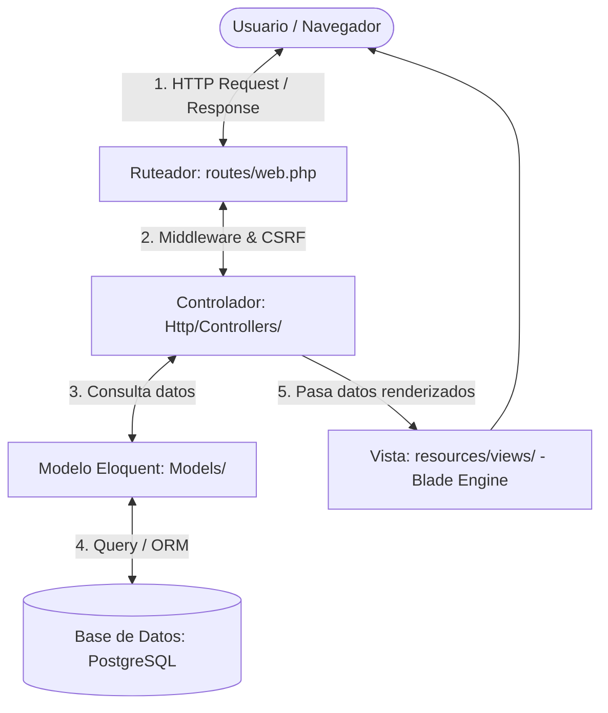
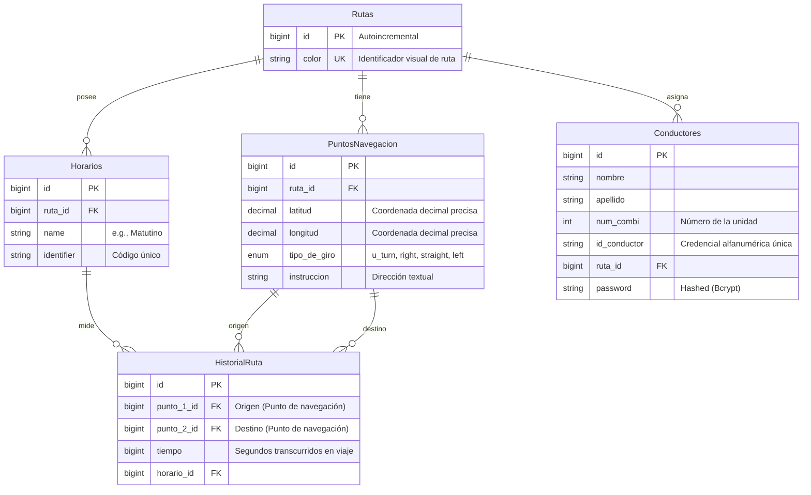

# PROYECTO ZITARUTAS: SISTEMA DE MONITOREO DE TRANSPORTE PÚBLICO
## *Un Estudio Práctico y Arquitectónico del Patrón MVC en Laravel 13*

---

## 📑 Resumen Ejecutivo

Este documento constituye una guía técnica y un estudio arquitectónico sobre la implementación del patrón **Modelo-Vista-Controlador (MVC)** dentro del proyecto **ZitaRutas**, un sistema de seguimiento y monitoreo de transporte público orientado al usuario final. La aplicación permite a los pasajeros consultar rutas de combis/autobuses en tiempo real, visualizar puntos de navegación en el mapa y predecir tiempos de llegada en función del historial registrado.

El proyecto está construido sobre el framework **Laravel 13** utilizando el motor de persistencia de datos **PostgreSQL** y el ORM **Eloquent**, garantizando seguridad (mediante tokens CSRF y hashing de contraseñas) y estabilidad a través de un esquema sólido de **pruebas unitarias y de integración**.

---

## 📐 1. Fundamentos del Patrón MVC en Laravel

El patrón **Model-View-Controller (MVC)** divide la lógica de la aplicación en tres componentes fundamentales para desacoplar el código, facilitar el mantenimiento y mejorar la escalabilidad:



1. **El Modelo (Model - M):** Encapsula el estado de la aplicación, las reglas de negocio y la comunicación directa con el motor de base de datos. En Laravel, esto se implementa de forma sumamente ágil mediante **Eloquent ORM**, donde cada tabla en PostgreSQL se mapea de manera declarativa a una clase PHP.
2. **La Vista (View - V):** Representa la interfaz de usuario y la presentación de la información. Laravel implementa la vista a través del motor de plantillas **Blade**, permitiendo combinar HTML puro con estructuras de control dinámicas de PHP de forma limpia.
3. **El Controlador (Controller - C):** Actúa como el intermediario o cerebro del sistema. Recibe la petición del usuario (Request) a través del ruteador web, interactúa con el modelo correspondiente para consultar o modificar la información y finalmente retorna una vista formateada o datos JSON.

---

## 📁 2. Análisis del Directorio y Arquitectura de Carpetas

A continuación, se detalla la función de cada una de las carpetas clave inicializadas en el proyecto. Aquellas marcadas con `.gitkeep` se mantendrán visibles en los repositorios de Git aunque estén vacías momentáneamente:

| Ruta del Directorio | Propósito Arquitectónico en el Patrón MVC |
| :--- | :--- |
| `app/Models/` | **[MODELO]** Almacena las clases de Eloquent. Define las propiedades de las tablas de base de datos, sus casts y las relaciones relacionales de cardinalidad (e.g. `HasMany`, `BelongsTo`). |
| `app/Http/Controllers/` | **[CONTROLADOR]** Contiene la lógica que responde a las peticiones HTTP, gestiona transacciones y redirecciona el flujo de la aplicación. |
| `app/Http/Middleware/` | Filtros de peticiones HTTP (e.g., control de autenticación de conductores, verificación de sesión y protección **CSRF** global). |
| `app/Http/Requests/` | Clases de validación de formularios y datos de entrada. Separa la lógica de validación de los controladores. |
| `app/Services/` | Capa intermedia opcional para lógica compleja de negocios (e.g., algoritmos de cálculo de distancias y estimación de tiempos de llegada). |
| `app/Repositories/` | Capa para abstraer el acceso a datos. Permite desacoplar Eloquent de la lógica de negocio para futuros cambios de proveedor de datos. |
| `app/Events/` & `app/Listeners/` | Implementación del patrón de observador. Útil para disparar acciones asíncronas como notificaciones de retrasos en rutas en tiempo real. |
| `app/Notifications/` | Gestión de envíos de alertas multicanal (correo electrónico, base de datos, SMS o push). |
| `app/Policies/` | Gestión fina de permisos y autorizaciones (e.g., qué conductor puede editar su propia combi). |
| `database/migrations/` | Historial de versiones de la base de datos escrito en PHP. Permite levantar, modificar y versionar las tablas PostgreSQL de manera ágil. |
| `database/factories/` & `seeders/` | Generadores de datos simulados (Faker) para poblar la base de datos durante pruebas o desarrollo local. |
| `resources/views/` | **[VISTA]** Almacena las plantillas del motor Blade (.blade.php) organizadas por recurso. |
| `routes/web.php` | Declaración de los puntos de entrada (URLs) HTTP mapeados a métodos específicos de los controladores correspondientes. |
| `tests/Unit/` | Pruebas sumamente veloces aisladas a nivel de métodos individuales de modelos o helpers sin tocar la base de datos. |
| `tests/Feature/` | Pruebas de integración que simulan llamadas HTTP reales de clientes, flujos de login y validación de respuestas HTML/JSON. |

---

## 🗃️ 3. Las Entidades y Estructura de Datos (M)

La base de datos se ha estructurado para responder a las necesidades críticas del monitoreo de rutas en tiempo real.



### Detalle de los Modelos Creados:

1. **`Ruta.php` ([Código](file:///C:/Users/odtgo/Documents/ProgramingLanguages/Proyectos/ZitaRutas/ZitaRutas/app/Models/Ruta.php)):**
   * **Propósito:** Agrupar y dar identidad a un recorrido mediante un color único.
   * **Relaciones:** `hasMany` `PuntoNavegacion`, `hasMany` `Horario`, `hasMany` `Conductor`.
2. **`PuntoNavegacion.php` ([Código](file:///C:/Users/odtgo/Documents/ProgramingLanguages/Proyectos/ZitaRutas/ZitaRutas/app/Models/PuntoNavegacion.php)):**
   * **Propósito:** Almacenar coordenadas de geolocalización ultra precisas utilizando floats de alta precisión (`decimal(10, 7)`) en lugar de longs simples, garantizando exactitud de centímetros en mapas.
   * **Relaciones:** `belongsTo` `Ruta`, `hasMany` `HistorialRuta` (como punto de origen o de destino).
3. **`Horario.php` ([Código](file:///C:/Users/odtgo/Documents/ProgramingLanguages/Proyectos/ZitaRutas/ZitaRutas/app/Models/Horario.php)):**
   * **Propósito:** Segmentar las mediciones de viaje por franjas del día (ej. Hora Pico Mañana, Tarde) permitiendo predicciones más realistas dependientes del tráfico temporal.
   * **Relaciones:** `belongsTo` `Ruta`, `hasMany` `HistorialRuta`.
4. **`HistorialRuta.php` ([Código](file:///C:/Users/odtgo/Documents/ProgramingLanguages/Proyectos/ZitaRutas/ZitaRutas/app/Models/HistorialRuta.php)):**
   * **Propósito:** Almacenar la métrica temporal en segundos que demoró recorrer el segmento entre dos puntos de navegación. De aquí se deducen los tiempos de espera del usuario final.
   * **Relaciones:** `belongsTo` `PuntoNavegacion` (`punto1` y `punto2`), `belongsTo` `Horario`.
5. **`Conductor.php` ([Código](file:///C:/Users/odtgo/Documents/ProgramingLanguages/Proyectos/ZitaRutas/ZitaRutas/app/Models/Conductor.php)):**
   * **Propósito:** Representar las credenciales de los choferes encargados de transmitir su ubicación.
   * **Seguridad:** Extiende `Illuminate\Foundation\Auth\User` (Authenticatable) para posibilitar inicio de sesión directo, oculta contraseñas de las serializaciones mediante `$hidden` y fuerza el hash mediante `casts` de contraseña.
   * **Relaciones:** `belongsTo` `Ruta`.

> 💡 **Nota sobre "Favoritos":** Siguiendo las directrices arquitectónicas del diseño, la entidad de **Favoritos** se procesará de manera puramente local en el navegador del usuario utilizando la API de `localStorage`. De esta manera, el usuario puede marcar rutas predilectas sin necesidad de autenticarse en el backend de forma obligatoria, aliviando la carga transaccional de PostgreSQL.

---

## 🛣️ 4. Controladores y el Ciclo de Ruteo (C)

Laravel utiliza controladores de tipo **Recurso (Resource)** para modelar operaciones estándar CRUD. Todos los archivos han sido estructurados con sus stubs listos para inyección de dependencias.

* **[RutaController.php](file:///C:/Users/odtgo/Documents/ProgramingLanguages/Proyectos/ZitaRutas/ZitaRutas/app/Http/Controllers/RutaController.php):** Administra el catálogo de rutas activas de combis.
* **[PuntoNavegacionController.php](file:///C:/Users/odtgo/Documents/ProgramingLanguages/Proyectos/ZitaRutas/ZitaRutas/app/Http/Controllers/PuntoNavegacionController.php):** Modifica o añade coordenadas a los caminos.
* **[HorarioController.php](file:///C:/Users/odtgo/Documents/ProgramingLanguages/Proyectos/ZitaRutas/ZitaRutas/app/Http/Controllers/HorarioController.php):** Define las franjas horarias de operación.
* **[HistorialRutaController.php](file:///C:/Users/odtgo/Documents/ProgramingLanguages/Proyectos/ZitaRutas/ZitaRutas/app/Http/Controllers/HistorialRutaController.php):** Registra los tiempos transcurridos de viaje para alimentar los modelos matemáticos de predicción.
* **[ConductorController.php](file:///C:/Users/odtgo/Documents/ProgramingLanguages/Proyectos/ZitaRutas/ZitaRutas/app/Http/Controllers/ConductorController.php):** CRUD administrativo de conductores.
* **[AuthController.php](file:///C:/Users/odtgo/Documents/ProgramingLanguages/Proyectos/ZitaRutas/ZitaRutas/app/Http/Controllers/AuthController.php):** Gestiona el ciclo de vida de la autenticación de los choferes (login, logout, sesiones).

### El Middleware y la Directiva `@csrf`
Cada formulario interactivo generado en las vistas Blade deberá obligatoriamente inyectar un campo oculto token mediante la directiva `@csrf` de Blade:
```html
<form method="POST" action="/login">
    @csrf
    <!-- Campos del formulario -->
</form>
```
El Middleware `VerifyCsrfToken` intercepta esta petición POST garantizando que provenga del sitio original del usuario y no de un ataque Cross-Site Request Forgery externo.

---

## 🖥️ 5. La Interfaz de Usuario y Vistas (V)

Las vistas del sistema se ubican en `resources/views/`. Se ha modularizado el directorio en carpetas específicas para cada entidad, facilitando la escalabilidad del lado del frontend:

* `views/layouts/`: Plantilla maestra compartida (Navbar, footer, inyecciones CSS y JS globales).
* `views/auth/`: Formularios de inicio de sesión de conductores.
* `views/rutas/` & `views/puntos_navegacion/`: Interfaces interactivas de mapas y catálogos de transporte público enfocados al ciudadano.
* `views/conductores/`, `views/horarios/`, `views/historial_rutas/`: Paneles administrativos internos del sistema.

---

## 🧪 6. Calidad y Pruebas (TDD)

El proyecto cuenta con un entorno de pruebas robusto configurado mediante **PHPUnit**:

### Pruebas Unitarias (`tests/Unit/`)
Prueban la atomicidad del código (e.g., que el modelo `Ruta` instancie correctamente relaciones de base de datos o casts de datos).
* `RutaTest.php`, `PuntoNavegacionTest.php`, `HorarioTest.php`, `HistorialRutaTest.php`, `ConductorTest.php`

### Pruebas de Integración y API (`tests/Feature/`)
Simulan flujos reales de la aplicación web:
* `RutaApiTest.php`: Verifica que las peticiones a endpoints de rutas devuelvan respuestas exitosas (200 OK) y listas de coordenadas válidas.
* `ConductorAuthTest.php`: Valida que los conductores con credenciales erróneas sean rechazados y los válidos reciban la sesión segura.

---

## 🚀 7. Guía de Inicio Rápido (Setup Local)

Para levantar la estructura completa en tu entorno local, sigue los pasos a continuación:

### Requisitos Previos
* PHP 8.4+ instalado ( Herd o php cli local)
* Composer 2.9.5+
* Instancia local de PostgreSQL corriendo

### Paso 1: Configurar Base de Datos en `.env`
Asegúrate de configurar los parámetros de conexión correspondientes en el archivo `.env`:
```ini
DB_CONNECTION=pgsql
DB_HOST=127.0.0.1
DB_PORT=5432
DB_DATABASE=zita_rutas
DB_USERNAME=postgres
DB_PASSWORD=tu_contraseña_aqui
```

### Paso 2: Instalar Dependencias de Composer
Las librerías y componentes de Laravel son descargadas y alojadas automáticamente en la carpeta de `/vendor` ejecutando:
```bash
composer install
```

### Paso 3: Ejecutar Migraciones
Genera la base de datos y todas las tablas relacionales de PostgreSQL mapeadas por los modelos:
```bash
php artisan migrate
```

### Paso 4: Correr Suite de Pruebas
Valida que la arquitectura esté 100% libre de lógicas quebradas ejecutando PHPUnit:
```bash
php artisan test
```

### Paso 5: Servir la Aplicación
Arranca el servidor local de desarrollo de Laravel:
```bash
php artisan serve
```
La aplicación estará disponible para visualización y desarrollo en `http://127.0.0.1:8000`.
